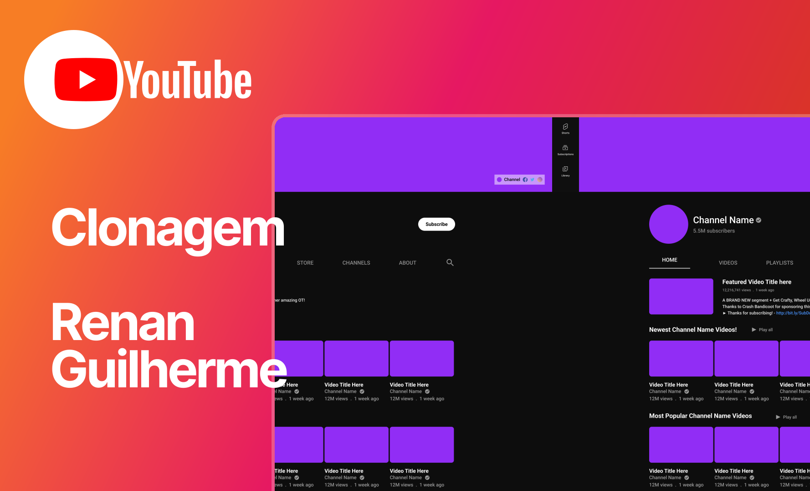

# 📺 Clone da Interface do YouTube



Este projeto é uma clonagem visual da interface do YouTube feita inteiramente com **HTML e CSS**.  
Foi desenvolvido como exercício prático durante meus estudos iniciais em desenvolvimento web.

---

## 🚀 Funcionalidades

- Estrutura fiel à página inicial de um canal no YouTube
- Layout responsivo (parcial)
- Estilização com CSS puro
- Sem JavaScript — foco total em HTML e CSS

---

## 📸 Preview

Veja uma prévia do resultado final:


---

## 🛠️ Tecnologias Utilizadas

- HTML5
- CSS3

---

## 📁 Estrutura do Projeto

```bash
📦 youtube-clone/
├── index.html
├── style.css
└── capa.png
```

## 🧠 O que eu aprendi

- Utilização de Flexbox para alinhar elementos;
- Organização semântica com tags HTML5;
- Aplicação de boas práticas de CSS;
- Como estruturar páginas seguindo um modelo real.

## 📌 Observações
Este projeto ainda está em desenvolvimento. Estou atualmente estudando somente HTML e CSS, então muitas funcionalidades ainda não estão presentes.

## 💬 Contribuição
Caso queira dar sugestões ou feedback, será muito bem-vindo!

## 📫 Contato
Renan Guilherme <br>

LinkedIn | [Renan Guilherme](https://www.linkedin.com/in/renan-guilherme/) <br>
E-mail |  [renanguilherme.profissional@outlook.com](renanguilherme.profissional@outlook.com)

## ⭐ Agradecimento
Se gostou do projeto, deixe uma estrela ⭐ aqui no repositório!
